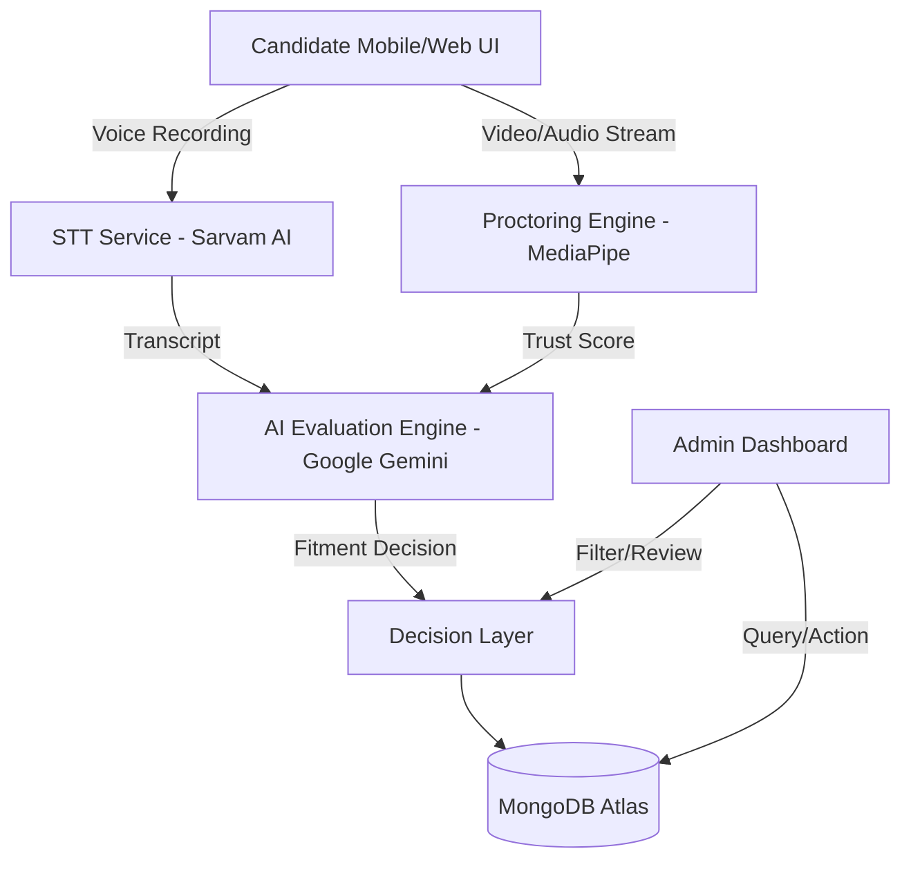

# HireVaani — AI-Led Multilingual Assessment Platform

HireVaani is a scalable, AI-driven candidate screening platform designed for the Indian workforce, supporting **Kannada-first** multilingual interactions, reliable skill classification, and real-time proctoring.

---

## Solution Overview

HireVaani addresses the challenge of large-scale candidate screening for the blue-collar and semi-skilled workforce. It provides an end-to-end AI agent that handles the entire interview process, assessment, and classification for government and enterprise stakeholders.

---

## System Architecture



---

## Core Features (Functional Prototype)

### 1. AI-Led Video Interview
*   **Multilingual Support**: Full voice-to-text integration for **Kannada**, **Hindi**, and **English** using Sarvam AI.
*   **Structured Questioning**: Dynamic AI-led interview flow based on selected job roles.
*   **Natural Speech Handling**: Robust processing of real-world speech patterns, including regional accents.

### 2. Response Assessment
*   **Automated Evaluation**: Gemini-powered analysis of responses for relevance, clarity, and domain confidence.
*   **Fitment Classification**: Automatic categorization into:
    *   **Job-ready**
    *   **Requires Training**
    *   **Manual Verification**
    *   **Low-Confidence**

### 3. Integrity & Proctoring
*   **Face Tracking**: Real-time monitoring using MediaPipe to detect frame exits or multiple faces.
*   **Trust Score**: A dynamic integrity metric generated per session to flag suspicious behavior.

### 4. Admin Decision Dashboard
*   **Interview Management**: Create roles with custom descriptions and set **Start/Deadline** dates.
*   **Candidate Drill-down**: Detailed view of AI transcripts, skill radar charts, and proctoring logs.
*   **Stakeholder Tools**: Filter by role, skill, and language to streamline shortlisting.

---

## Detailed Setup Guide

### 1. Prerequisites
*   **Node.js**: v18.x or higher
*   **npm**: v9.x or higher
*   **Browser**: Google Chrome (required for MediaPipe WASM features)
*   **API Keys**: You will need keys from **Sarvam AI** and **Google AI Studio (Gemini)**.

### 2. Installation

Clone the repository and install dependencies for both the frontend and backend:

```bash
# Clone the repository
git clone https://github.com/JayantSinghRawat/HireVaani.git
cd HireVaani

# Install Server dependencies
cd server
npm install

# Install Client dependencies
cd ../client
npm install
```

### 3. Configuration

Create a `.env` file in the `server` directory and populate it with the following:

```env
# API Keys
SARVAM_API_KEY=your_sarvam_api_key
GEMINI_API_KEY=your_gemini_api_key

# Database (Leave blank for In-Memory/Dev mode)
MONGODB_URI=your_mongodb_connection_string

# Security
JWT_SECRET=your_secret_string
ADMIN_USER=admin
ADMIN_PASS=admin123

# Server Config
PORT=8000
```

### 4. Running the Application

You need to run both the backend and frontend simultaneously.

**Start Backend (Terminal 1):**
```bash
cd server
npm run dev
```

**Start Frontend (Terminal 2):**
```bash
cd client
npm run dev
```

The application will be accessible at `http://localhost:5173`.


## Evaluation & Proctoring

### AI Skill Radar
Gemini evaluates every response across 5 critical dimensions:
*   **Technical Proficiency**: Depth of domain knowledge.
*   **Clarity & Structure**: Coherence and logical flow.
*   **Communication**: Fluency and expressiveness.
*   **Confidence**: Assertiveness in delivery.
*   **Relevance**: Accuracy in addressing the role-specific problem.

### Trust Score (Proctoring)
The system tracks the candidate's presence in real-time:
*   **Perfect Score (100%)**: Face detected throughout the session.
*   **Deductions**: Automatically penalizes the score if the candidate looks away, leaves the frame, or if multiple faces are detected.


---

## Development & Authorship

This project is built using a combination of manual developer implementation and AI-assisted **Vibe Coding**:

### Built Manually by the Developer (Jayant Singh Rawat):
*   **EJS Templates, HTML, & CSS:** Built the interview and dashboard pages using EJS templates with HTML and CSS, pulling data from the backend and displaying it on the page to serve directly from the server.
*   **REST API Endpoints:** Developed REST API endpoints in Node.js and Express.js to handle interview data — taking in requests, processing them, and sending back the response.
*   **Database Integration:** Wrote backend code to fetch candidate data (transcripts, scores) from the database and show it on the admin dashboard, with the option to filter by role.
*   **AI API Integrations:** Integrated the Sarvam AI and Google Gemini APIs into the backend, sending candidate responses to these APIs and handling the data they returned.
*   **Client-Side Validation:** Added form validation so required fields like name and role selection are checked before the form is submitted to the server.
*   **API Testing:** Used Postman to test the API endpoints for creating and fetching interview records, making sure data was correctly saved and read.
*   **Version Control:** Used Git for version control, organizing commits by feature (pages, routes, dashboard) and pushing them to GitHub throughout development.

### Built Using Vibe Coding (AI Collaboration on GitHub):
*   **MediaPipe Proctoring:** The face-tracking and real-time gaze detection proctoring system using MediaPipe.


